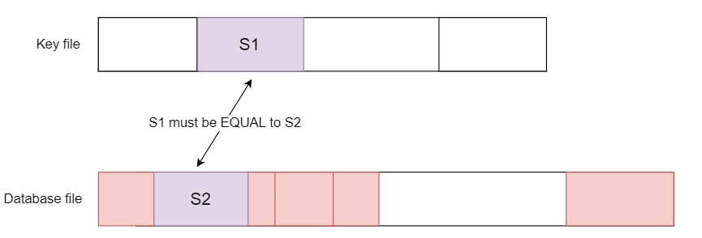
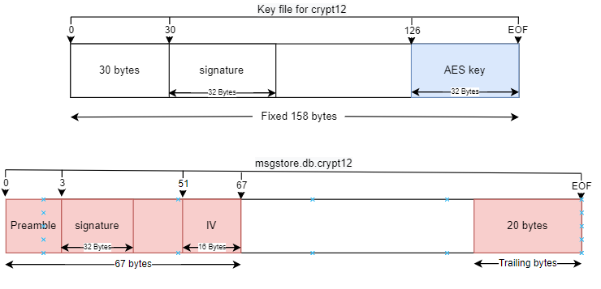
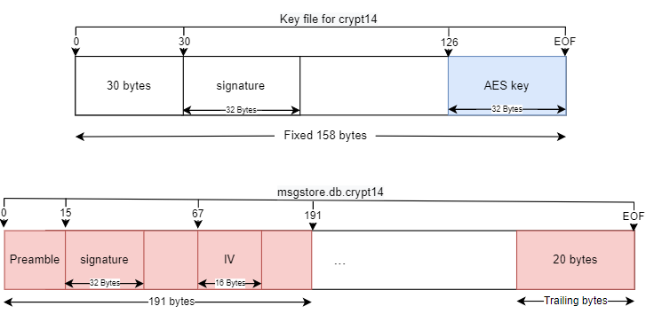

# wadec -  WhatsApp decrypt library in Java for Crypt12 and Crypt14.


## Verification 



### Crypt12




### Crypt14


#### Changes
The key  is still the same.
AES/GCM - BouncingCastle 

References:
https://www.bouncycastle.org/specifications.html


#### Usage
```java -jar wadec.jar  <key>  <database.db.cryptedXX>  [output]``` 
if output is omitted the decrypted database generated will have the same name of the input without the suffix.   


#### Credits
The research and the development was made by me, but the credit must go to SPI (Setor de Perícias de Informática) of Rio de Janeiro Police Forensics because we are always investing in research and development.  


> Documentation for TLDR friends !-D

Enjoy, 
  [Marcelo](https://www.linkedin.com/in/marcelo-aleks/)


